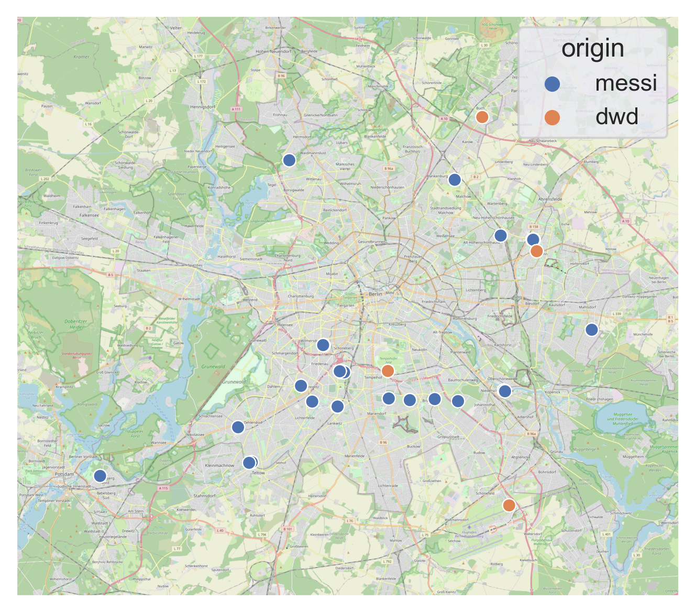

# MESSI Cluster Analysis

MESSIs are relatively small self-powered weather stations which continuously monitor multiple environmental parameters. The instruments are set up in allotments around Berlin (Germany) as part of the citizen science project [OpenUCO](https://www.geo.fu-berlin.de/met/wexicom/OpenUCO).

In this university project, temperature data measured by MESSIs every 10min in August 2022 is used.

(kmeans)[https://scikit-learn.org/stable/modules/generated/sklearn.cluster.KMeans.html] is an unsupervised learning algorithm which separates samples into groups (*clusters*). Trying different sets of features and changing the total number of clusters, this analysis aims to find daily clusters that are reasonably consistent in time.

The most up-to-date, somewhat automated, analysis is notebook #5 (`code/5-scaled-features-perday.ipynb`) and should exclusively be considered if details about the coding part are of concern.

Further results are shown in the final presentation slides (`präsi-messi-clustering.pdf`).
